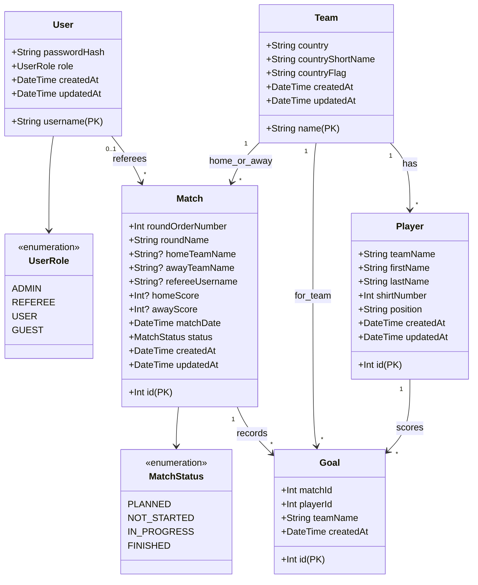
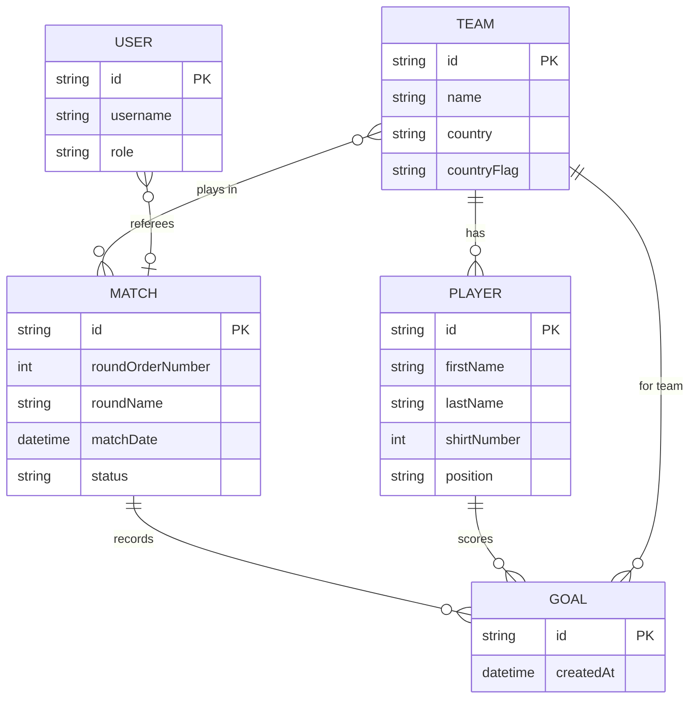
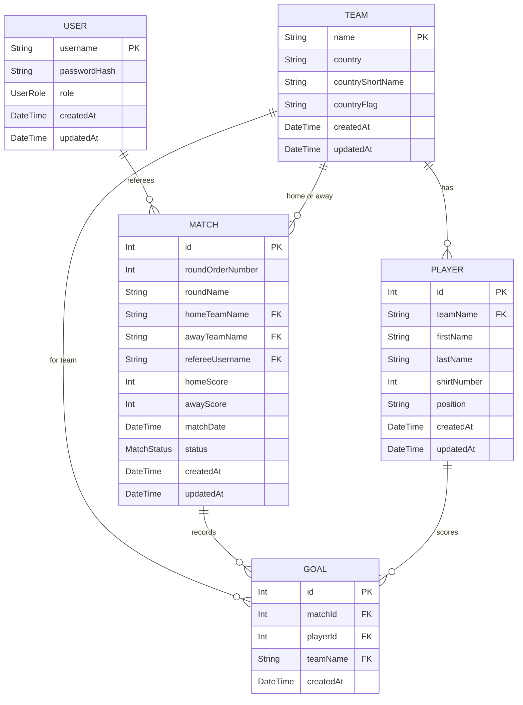

# Project Schema - worldcup-manager-2026

This document centralizes the analysis data model in one place, derived directly from `back-end/repository/prisma/schema.prisma`.

- all entities and enums
- key relationships
- UML class diagram
- conceptual ERD
- logical ERD

## 1. Enums

### UserRole

```
ADMIN | REFEREE | USER | GUEST
```

### MatchStatus

```
PLANNED | NOT_STARTED | IN_PROGRESS | FINISHED
```

## 2. Entities

### User

- username: String (PK)
- passwordHash: String
- role: UserRole (default: USER)
- createdAt: DateTime
- updatedAt: DateTime

### Team

- name: String (PK, UNIQUE)
- country: String
- countryShortName: String
- countryFlag: String
- createdAt: DateTime
- updatedAt: DateTime

### Match

- id: Int (AUTOINCREMENT, PK)
- roundOrderNumber: Int
- roundName: String
- homeTeamName: String? (FK → Team.name, optional)
- awayTeamName: String? (FK → Team.name, optional)
- refereeUsername: String? (FK → User.username, optional)
- homeScore: Int?
- awayScore: Int?
- matchDate: DateTime
- status: MatchStatus (default: PLANNED)
- createdAt: DateTime
- updatedAt: DateTime

### Player

- id: Int (AUTOINCREMENT, PK)
- teamName: String (FK → Team.name)
- firstName: String
- lastName: String
- shirtNumber: Int
- position: String
- createdAt: DateTime
- updatedAt: DateTime
- UNIQUE constraint: (teamName, shirtNumber)

### Goal

- id: Int (AUTOINCREMENT, PK)
- matchId: Int (FK → Match.id)
- playerId: Int (FK → Player.id)
- teamName: String (FK → Team.name)
- createdAt: DateTime

## 3. Relationship Overview

- Team 1 → N Player
- Team 1 → N Goal (scoring team)
- Team 1 → N Match (as homeTeam or awayTeam)
- Match 1 → N Goal
- Player 1 → N Goal
- User (referee) 0..1 → N Match (assignedMatches)

Business rule highlights:

- Each team has at least 15 seeded players
- Stage progression uses `Match.roundOrderNumber` ordering (no separate Round/Stage entity)
- Matches are pre-created at database seed time with `PLANNED` status
- Teams are assigned to matches during seeding (first stage) or during simulation (subsequent stages)
- No `minute` field on Goal — goals are recorded without timestamps; only `createdAt` is present
- `Goal.teamId` must match a team that is playing in the match
- `Goal.playerId` must belong to `Goal.teamId`

## 4. UML Class Diagram

See [drawio/uml-class-diagram.drawio](drawio/uml-class-diagram.drawio) for the editable diagram.



## 5. Conceptual ERD

See [drawio/erd-conceptual-fresh.drawio](drawio/erd-conceptual-fresh.drawio) for the editable diagram (Chen notation with entities, attributes, and relationship diamonds).



### Cardinality notes

| Relationship | From   | Cardinality | To     | Cardinality |
| ------------ | ------ | ----------- | ------ | ----------- |
| has          | TEAM   | (1, M)      | PLAYER | (1, 1)      |
| plays in     | TEAM   | (0, N)      | MATCH  | (1, M)      |
| referees     | USER   | (0, N)      | MATCH  | (0, 1)      |
| records      | MATCH  | (1, M)      | GOAL   | (1, 1)      |
| scores       | PLAYER | (0, N)      | GOAL   | (1, 1)      |
| for team     | TEAM   | (0, N)      | GOAL   | (1, 1)      |

## 6. Logical ERD

See [drawio/erd-logical.drawio](drawio/erd-logical.drawio) for the editable diagram.



## 7. Scope Note

This schema is intentionally modeled as a single fixed competition (World Cup 2026). Competition metadata (name/year/host/format) is provided through app configuration (`.env` or seed constants), not as a database entity.

The `Goal` model does not include a `minute` field — goals are recorded without a match-minute timestamp. Only `createdAt` is available. This is a deliberate design choice to keep the model simple for school purpose.
