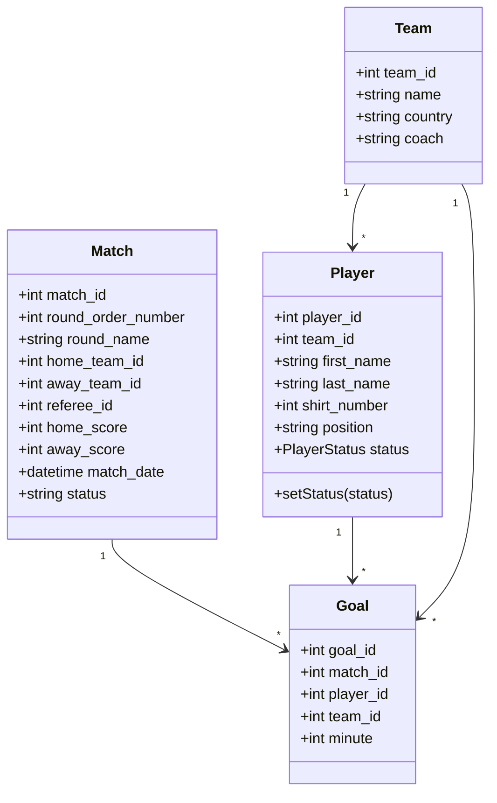
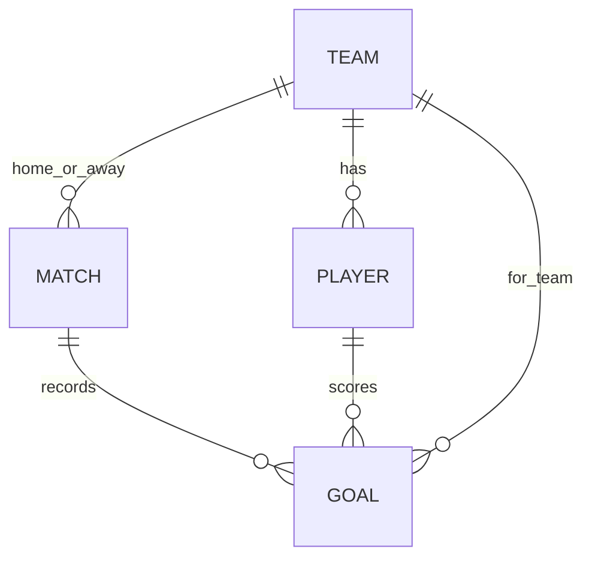
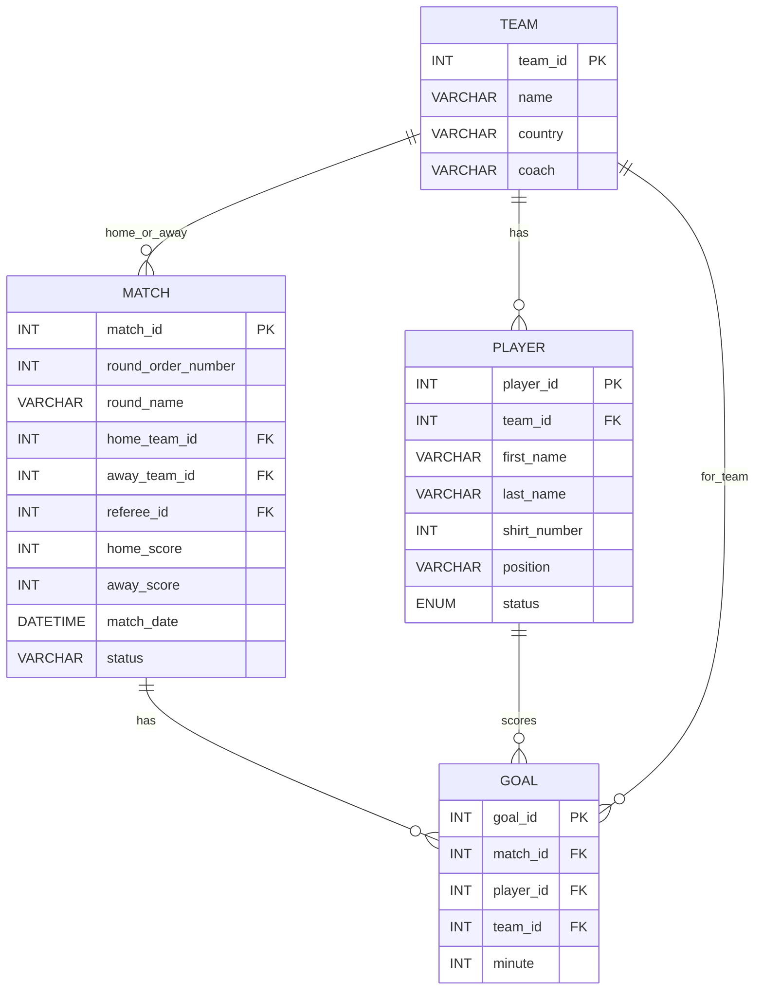

# Project Schema - worldcup-manager-2026

This document centralizes the analysis data model in one place:

- all entities
- key relationships
- UML class diagram
- conceptual ERD
- logical ERD

## 1. Entities

### Team

- team_id (PK)
- name
- country
- coach

### Match

- match_id (PK)
- round_order_number
- round_name
- home_team_id (FK -> Team)
- away_team_id (FK -> Team)
- referee_id (FK -> User, optional in this analysis model)
- home_score
- away_score
- match_date
- status

### Player

- player_id (PK)
- team_id (FK -> Team)
- first_name
- last_name
- shirt_number
- position
- status (available | unavailable)

### Goal

- goal_id (PK)
- match_id (FK -> Match)
- player_id (FK -> Player)
- team_id (FK -> Team)
- minute

## 2. Relationship Overview

- Team 1 -> N Player
- Match 1 -> N Goal
- Player 1 -> N Goal
- Team 1 -> N Goal
- Match N -> 1 Team (home_team_id)
- Match N -> 1 Team (away_team_id)

Business rule highlights:

- each team has at least 15 players
- player status is fixed to available/unavailable
- referee can only select available players when registering goal scorers
- stage progression uses Match.round_order_number ordering (no separate Round table)

## 3. UML Class Diagram

## 4. Conceptual ERD

## 5. Logical ERD

## 6. Scope Note

This schema is intentionally modeled as a single fixed competition (World Cup 2026). Competition metadata (name/year/host/format) is provided through app configuration (for example .env or JSON), not a database entity.
