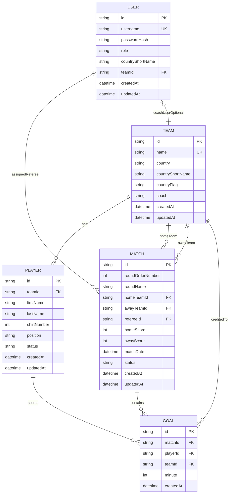

# 02 - Data Model, ERD, and ERP Perspective

## 1. Core Entities

- **User**: platform account with role and optional team assignment.
- **Team**: national team metadata, coach name, flag, short code.
- **Player**: belongs to a team, has shirt number and availability state.
- **Match**: fixture that stores round metadata directly (`roundOrderNumber`, `roundName`), links teams and referee, and stores score/status.
- **Goal**: event in a match by a player at a minute.

## 2. Match Status Vocabulary

- `NOT_STARTED`
- `IN_PROGRESS`
- `COMPLETED`

## 3. ERD (Mermaid)

## 4. Important Constraints

- `User.username` is unique.
- `Team.name` is unique.
- `Player(teamId, shirtNumber)` is unique.
- `Match.roundOrderNumber` is indexed for stage queries.
- `Match` and `Goal` have indexes on key foreign keys.

## 5. ERP Perspective (Business Objects + Process)

If you view this project in ERP terms:

- **Master data**:
  - Teams
  - Players
  - Users (with role and organization context)

- **Transactional data**:
  - Matches (status and scores)
  - Goals (event records)

- **Process data**:
  - Automatic stage activation
  - Round simulation
  - Match result finalization

This separation is useful for reporting and auditability.

## 6. Why This Model Fits Knockout Tournaments

- Round ordering is preserved through `Match.roundOrderNumber`.
- Match status lifecycle supports operational workflow.
- Goal events support detailed score reconstruction.
- Team/player separation enables coach-driven availability control.
