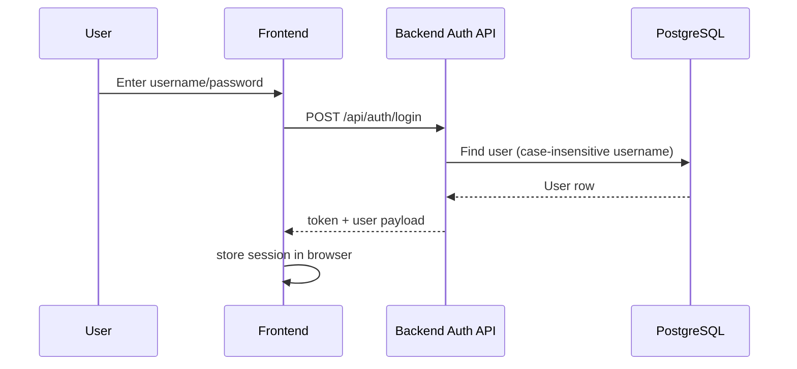
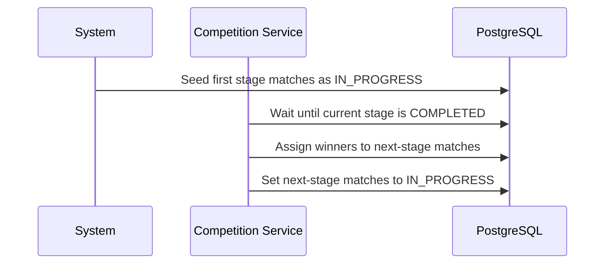
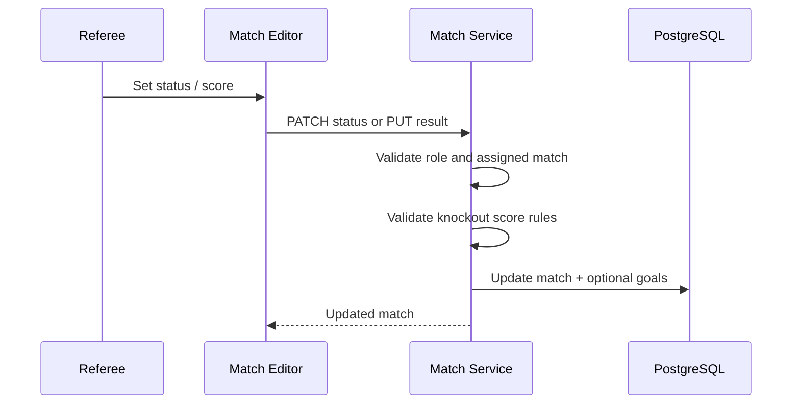
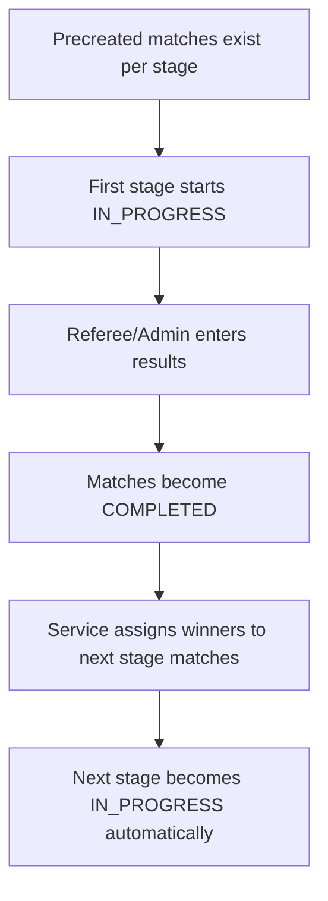

# 05 - Workflows and Sequence Diagrams

## 1. Login Flow

```mermaid
sequenceDiagram
    participant U as User
    participant FE as Frontend
    participant BE as Backend Auth API
    participant DB as PostgreSQL

    U->>FE: Enter username/password
    FE->>BE: POST /api/auth/login
    BE->>DB: Find user (case-insensitive username)
    DB-->>BE: User row
    BE-->>FE: token + user payload
    FE->>FE: store session in browser
```

## 2. Automatic Stage Activation

```mermaid
sequenceDiagram
    participant SYS as System
    participant BE as Competition Service
    participant DB as PostgreSQL

    SYS->>DB: Seed first stage matches as IN_PROGRESS
    BE->>DB: Wait until current stage is COMPLETED
    BE->>DB: Assign winners to next-stage matches
    BE->>DB: Set next-stage matches to IN_PROGRESS
```

## 3. Referee Match Update Flow

```mermaid
sequenceDiagram
    participant R as Referee
    participant FE as Match Editor
    participant BE as Match Service
    participant DB as PostgreSQL

    R->>FE: Set status / score
    FE->>BE: PATCH status or PUT result
    BE->>BE: Validate role and assigned match
    BE->>BE: Validate knockout score rules
    BE->>DB: Update match + optional goals
    BE-->>FE: Updated match
```

## 4. End-to-End Bracket Progression

```mermaid
flowchart TD
    A[Precreated matches exist per stage] --> B[First stage starts IN_PROGRESS]
    B --> C[Referee/Admin enters results]
    C --> D[Matches become COMPLETED]
    D --> E[Service assigns winners to next stage matches]
    E --> F[Next stage becomes IN_PROGRESS automatically]
```
