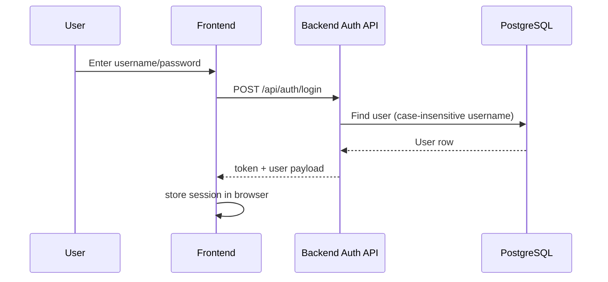
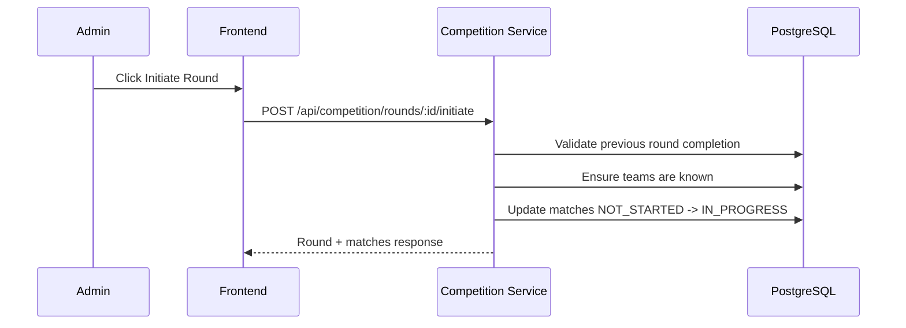
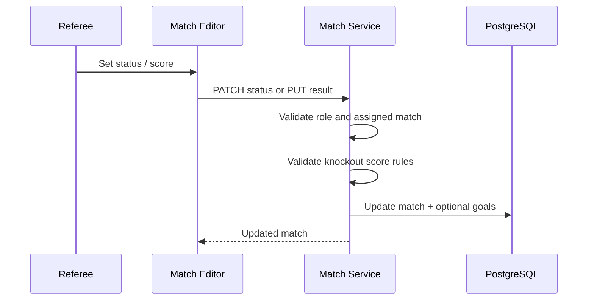
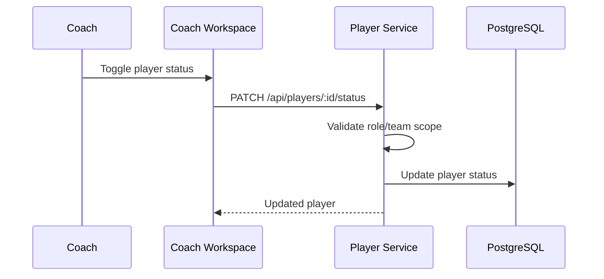
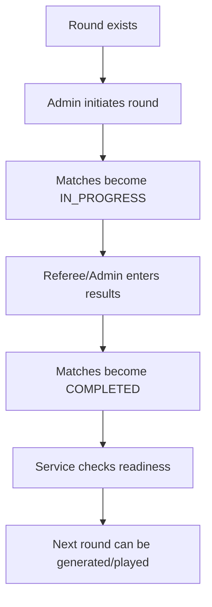

# 05 - Workflows and Sequence Diagrams

## 1. Login Flow

```mermaid
sequenceDiagram
    participant U as User
    participant FE as Frontend
    participant BE as Backend Auth API
    participant DB as PostgreSQL

    U->>FE: Enter username/password
    FE->>BE: POST /api/auth/login
    BE->>DB: Find user (case-insensitive username)
    DB-->>BE: User row
    BE-->>FE: token + user payload
    FE->>FE: store session in browser
```

## 2. Initiate Round (Admin)

```mermaid
sequenceDiagram
    participant A as Admin
    participant FE as Frontend
    participant BE as Competition Service
    participant DB as PostgreSQL

    A->>FE: Click Initiate Round
    FE->>BE: POST /api/competition/rounds/:id/initiate
    BE->>DB: Validate previous round completion
    BE->>DB: Ensure teams are known
    BE->>DB: Update matches NOT_STARTED -> IN_PROGRESS
    BE-->>FE: Round + matches response
```

## 3. Referee Match Update Flow

```mermaid
sequenceDiagram
    participant R as Referee
    participant FE as Match Editor
    participant BE as Match Service
    participant DB as PostgreSQL

    R->>FE: Set status / score
    FE->>BE: PATCH status or PUT result
    BE->>BE: Validate role and assigned match
    BE->>BE: Validate knockout score rules
    BE->>DB: Update match + optional goals
    BE-->>FE: Updated match
```

## 4. Coach Availability Flow

```mermaid
sequenceDiagram
    participant C as Coach
    participant FE as Coach Workspace
    participant BE as Player Service
    participant DB as PostgreSQL

    C->>FE: Toggle player status
    FE->>BE: PATCH /api/players/:id/status
    BE->>BE: Validate role/team scope
    BE->>DB: Update player status
    BE-->>FE: Updated player
```

## 5. End-to-End Bracket Progression

```mermaid
flowchart TD
    A[Round exists] --> B[Admin initiates round]
    B --> C[Matches become IN_PROGRESS]
    C --> D[Referee/Admin enters results]
    D --> E[Matches become COMPLETED]
    E --> F[Service checks readiness]
    F --> G[Next round can be generated/played]
```
