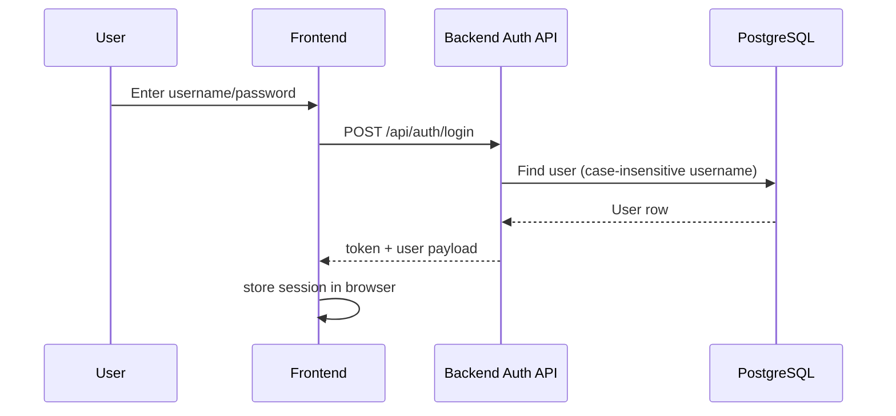
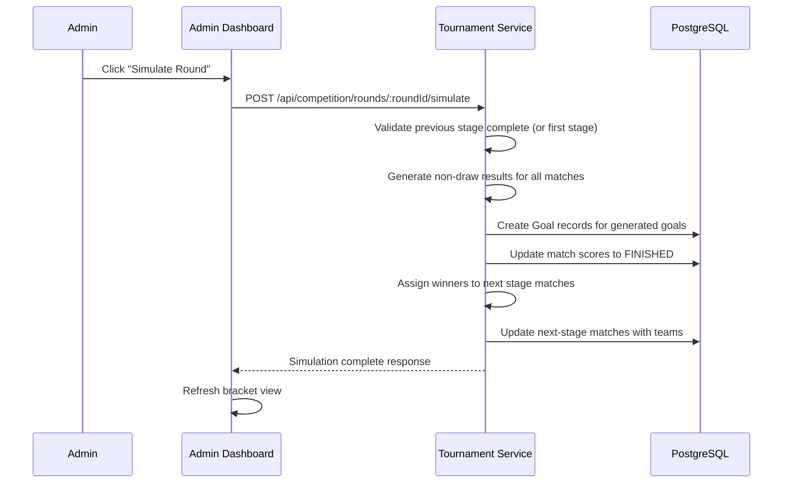

# 05 - Workflows and Sequence Diagrams

## 1. Login Flow



## 2. Tournament Simulation Flow (Admin)



## 3. Referee Match Update Flow

````mermaid
sequenceDiagram
    participant R as Referee
    participant FE as Match Editor
    participant BE as Match Service
    participant DB as PostgreSQL

    R->>FE: Set status and/or add goals
    FE->>BE: PATCH /matches/:matchId/status or PUT /result or POST /goals
    BE->>BE: Validate role (must be assigned referee)
    BE->>BE: Validate status transition (PLANNED->NOT_STARTED->IN_PROGRESS->FINISHED)
    BE->>BE: Validate previous stage completion (edit lock)
    BE->>BE: Validate knockout rules (non-draw if FINISHED)
    BE->>DB: Update match status and/or goals
    BE->>DB: Recalculate match score from goals
    BETournament Reset Flow (Admin)

```mermaid
sequenceDiagram
    participant A as Admin
    participant FE as Admin Dashboard
    participant BE as Tournament Service
    participant DB as PostgreSQL

    A->>FE: Click "Reset Matches"
    FE->>BE: POST /api/competition/reset-matches
    BE->>DB: Delete all Goal records
    BE->>DB: Clear match scores (set to null)
    BE->>DB: Reset all matches to PLANNED
    BE->>DB: Clear teams from non-first-stage matches
    BE-->>FE: Reset complete response
    FE->>FE: Refresh bracket view
````

## 5. End-to-End Bracket Progression

```mermaid
flowchart TD
    A["🌱 Seed: All stages precreated<br/>First stage: teams assigned<br/>Later stages: no teams yet"] -->|Admin clicks Simulate| B["⚙️ Simulate Round 1<br/>Generate results, FINISHED all<br/>Assign winners to Round 2"]
    B -->|Round 2 ready| C["⚙️ Simulate Round 2<br/>Generate results, FINISHED all<br/>Assign winners to Round 3"]
    C -->|Round 3 ready| D["⚙️ Simulate Round 3<br/>Generate results, FINISHED all<br/>Assign winners to Final"]
    D -->|Final ready| E["⚙️ Simulate Final<br/>Generate final result<br/>Tournament complete"]
    E -->|Admin can| F["Reset all and repeat"age starts IN_PROGRESS]
    B --> C[Referee/Admin enters results]
    C --> D[Matches become COMPLETED]
    D --> E[Service assigns winners to next stage matches]
    E --> F[Next stage becomes IN_PROGRESS automatically]
```
