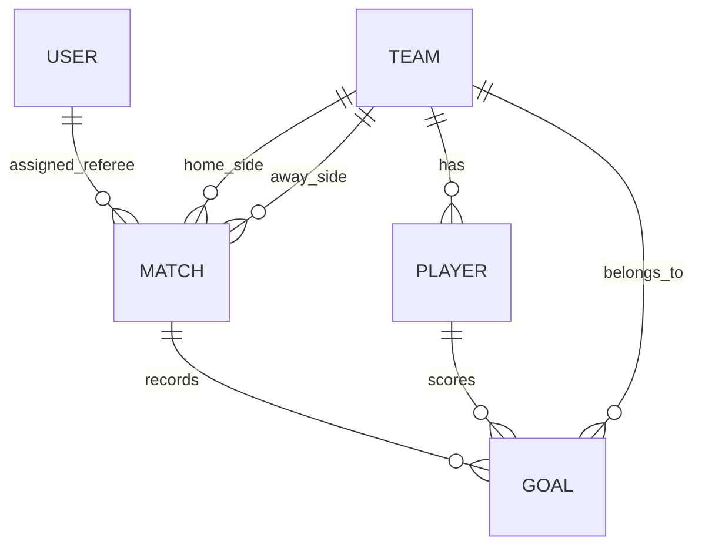

# 04 - Data Model and ERD

## 1. Entities

### User

- id (PK, string)
- username (unique)
- passwordHash
- role (`ADMIN`, `REFEREE`, `USER`, `GUEST`)
- teamId (nullable FK -> Team.id)
- createdAt
- updatedAt

### Team

- id (PK)
- name (unique)
- country
- countryShortName
- countryFlag
- createdAt
- updatedAt

### Player

- id (PK)
- teamId (FK -> Team.id)
- firstName
- lastName
- shirtNumber (unique within team)
- position
- status (`AVAILABLE`, `UNAVAILABLE`)
- createdAt
- updatedAt

### Match

- id (PK)
- roundOrderNumber
- roundName
- homeTeamId (nullable FK -> Team.id)
- awayTeamId (nullable FK -> Team.id)
- refereeId (nullable FK -> User.id)
- homeScore (nullable)
- awayScore (nullable)
- matchDate
- status (`PLANNED`, `NOT_STARTED`, `IN_PROGRESS`, `FINISHED`, `COMPLETED`)
- createdAt
- updatedAt

### Goal

- id (PK)
- matchId (FK -> Match.id)
- playerId (FK -> Player.id)
- teamId (FK -> Team.id)
- createdAt

## 2. Key relationships

- Team 1 -> N Player
- Team 1 -> N Match (as home)
- Team 1 -> N Match (as away)
- User (Referee) 1 -> N Match (assigned)
- Match 1 -> N Goal
- Player 1 -> N Goal
- Team 1 -> N Goal

## 3. Logical constraints

- Player unique constraint: (teamId, shirtNumber)
- Match index: roundOrderNumber
- Match index: refereeId
- Goal index: matchId, playerId, teamId

## 4. Conceptual ERD (Mermaid)



## 5. Logical ERD (Mermaid)

```mermaid
erDiagram
  USER {
    STRING id PK
    STRING username UNIQUE
    STRING passwordHash
    ENUM role
    STRING teamId FK
    DATETIME createdAt
    DATETIME updatedAt
  }

  TEAM {
    STRING id PK
    STRING name UNIQUE
    STRING country
    STRING countryShortName
    STRING countryFlag
    DATETIME createdAt
    DATETIME updatedAt
  }

  PLAYER {
    STRING id PK
    STRING teamId FK
    STRING firstName
    STRING lastName
    INT shirtNumber
    STRING position
    ENUM status
    DATETIME createdAt
    DATETIME updatedAt
  }

  MATCH {
    STRING id PK
    INT roundOrderNumber
    STRING roundName
    STRING homeTeamId FK
    STRING awayTeamId FK
    STRING refereeId FK
    INT homeScore
    INT awayScore
    DATETIME matchDate
    ENUM status
    DATETIME createdAt
    DATETIME updatedAt
  }

  GOAL {
    STRING id PK
    STRING matchId FK
    STRING playerId FK
    STRING teamId FK
    DATETIME createdAt
  }

  USER ||--o{ MATCH : assigned_referee
  TEAM ||--o{ PLAYER : has
  TEAM ||--o{ MATCH : home_side
  TEAM ||--o{ MATCH : away_side
  MATCH ||--o{ GOAL : records
  PLAYER ||--o{ GOAL : scores
  TEAM ||--o{ GOAL : belongs_to
```

## 6. Why no Round table

Round identity is fixed and finite for this MVP. Keeping round metadata inside Match keeps schema simpler while still enabling deterministic stage progression.
